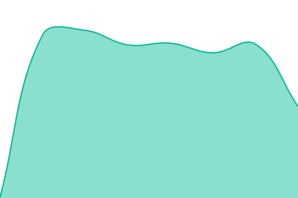
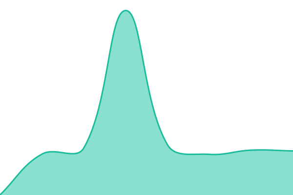
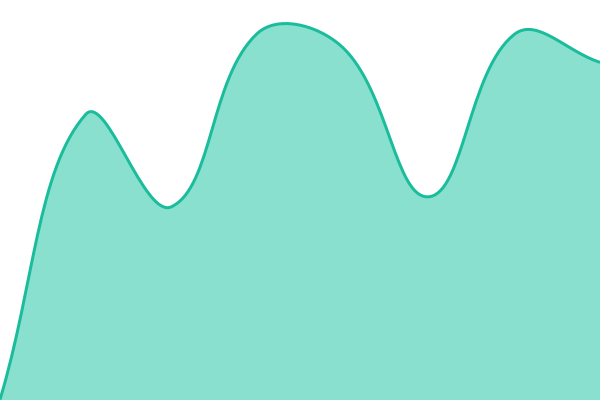

# [📈 Live Status](https://status.kakikou.app): <!--live status--> **🟩 All systems operational**

This repository contains the open-source uptime monitor and status page for [Kakikou](https://kakikou.app/), powered by [Upptime](https://github.com/upptime/upptime).

With [Upptime](https://upptime.js.org), you can get your own unlimited and free uptime monitor and status page, powered entirely by a GitHub repository. We use [Issues](https://github.com/kakik0u/status/issues) as incident reports, [Actions](https://github.com/kakik0u/status/actions) as uptime monitors, and [Pages](https://status.kakikou.app) for the status page.

<!--start: status pages-->
<!-- This summary is generated by Upptime (https://github.com/upptime/upptime) -->
<!-- Do not edit this manually, your changes will be overwritten -->
<!-- prettier-ignore -->
| URL | Status | History | Response Time | Uptime |
| --- | ------ | ------- | ------------- | ------ |
|  [Kakikou.app](https://kakikou.app) | 🟩 Up | [kakikou-app.yml](https://github.com/kakik0u/status/commits/HEAD/history/kakikou-app.yml) | 

 2559ms
     
 | 

<a href="https://status.kakikou.app/history/kakikou-app">96.93%</a>
    

|  本棚 | 🟩 Up | [本棚.yml](https://github.com/kakik0u/status/commits/HEAD/history/本棚.yml) | 

 2530ms
     
 | 

<a href="https://status.kakikou.app/history/本棚">96.95%</a>
    

|  本棚(API) | 🟩 Up | [api.yml](https://github.com/kakik0u/status/commits/HEAD/history/api.yml) | 

 2541ms
     
 | 

<a href="https://status.kakikou.app/history/api">96.96%</a>
    

|  Knet | 🟩 Up | [knet.yml](https://github.com/kakik0u/status/commits/HEAD/history/knet.yml) | 

 2507ms
     
 | 

<a href="https://status.kakikou.app/history/knet">96.97%</a>
    

|  Kexus | 🟩 Up | [kexus.yml](https://github.com/kakik0u/status/commits/HEAD/history/kexus.yml) | 

 2466ms
     
 | 

<a href="https://status.kakikou.app/history/kexus">96.98%</a>
    

|  Solocord | 🟩 Up | [solocord.yml](https://github.com/kakik0u/status/commits/HEAD/history/solocord.yml) | 

 2719ms
     
 | 

<a href="https://status.kakikou.app/history/solocord">96.99%</a>
    

|  ProjectSEKAM | 🟩 Up | [project-sekam.yml](https://github.com/kakik0u/status/commits/HEAD/history/project-sekam.yml) | 

 2693ms
     
 | 

<a href="https://status.kakikou.app/history/project-sekam">97.00%</a>
    

|  KakiContent | 🟩 Up | [kaki-content.yml](https://github.com/kakik0u/status/commits/HEAD/history/kaki-content.yml) | 

 2539ms
     
 | 

<a href="https://status.kakikou.app/history/kaki-content">97.01%</a>
    

|  K-rome | 🟩 Up | [k-rome.yml](https://github.com/kakik0u/status/commits/HEAD/history/k-rome.yml) | 

 2418ms
     
 | 

<a href="https://status.kakikou.app/history/k-rome">97.03%</a>
    

|  KakikouAuth | 🟩 Up | [kakikou-auth.yml](https://github.com/kakik0u/status/commits/HEAD/history/kakikou-auth.yml) | 

 2630ms
     
 | 

<a href="https://status.kakikou.app/history/kakikou-auth">97.04%</a>
    

|  KakikouLink | 🟩 Up | [kakikou-link.yml](https://github.com/kakik0u/status/commits/HEAD/history/kakikou-link.yml) | 

 2506ms
     
 | 

<a href="https://status.kakikou.app/history/kakikou-link">97.05%</a>
    

|  Server-OCI | 🟩 Up | [server-oci.yml](https://github.com/kakik0u/status/commits/HEAD/history/server-oci.yml) | 

 515ms
     
 | 

<a href="https://status.kakikou.app/history/server-oci">100.00%</a>
    

|  Server-CB | 🟩 Up | [server-cb.yml](https://github.com/kakik0u/status/commits/HEAD/history/server-cb.yml) | 

 2473ms
     
 | 

<a href="https://status.kakikou.app/history/server-cb">97.06%</a>
    

<!--end: status pages-->

[**Visit our status website →**](https://status.kakikou.app)

## 📄 License

- Powered by: [Upptime](https://github.com/upptime/upptime)
- Code: [MIT](./LICENSE) © [Anand Chowdhary](https://anandchowdhary.com)
- Data in the `./history` directory: [Open Database License](https://opendatacommons.org/licenses/odbl/1-0/)
